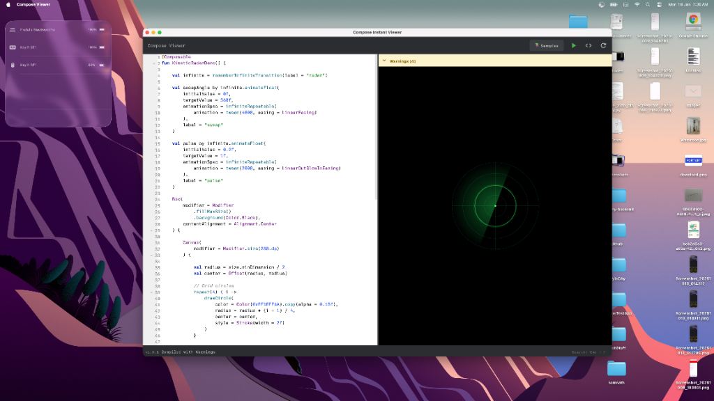

# Compose Viewer

[](https://github.com/ranjeetchouhan/compose-code-viewer/stargazers)
[](https://github.com/ranjeetchouhan/compose-code-viewer/issues)
[](https://opensource.org/licenses/MIT)
[](https://github.com/ranjeetchouhan/compose-code-viewer/releases/tag/v1.0.2)

**Compose Viewer** is a real-time Jetpack Compose Desktop code editor and previewer. Write Kotlin Compose UI code and see the results instantly - perfect for prototyping, learning, and experimenting with Compose Multiplatform.



## ✨ Features

### Core Features
- **Live Preview**: Instant compilation and preview as you type
- **External Compatibility**:
  - **Dynamic Auto-Mocking**: Automatically handles external types (e.g. `ChuckerTheme`) and Android APIs (`stringResource`, `R.string`) for easy copy-pasting from existing projects.
  - **Smart Entry-Point**: Prioritizes no-argument `@Composable` functions (Previews) as targets.
- **File Management**:
  - **Save as .kt**: Persistent save icon and `Cmd+S` keyboard shortcut.
  - **Import .kt**: Quickly open existing Compose files with `Cmd+O`.
- **Advanced Editor**:
  - **Intelligent Autocomplete**: Prefilled snippets for common components (`Text`, `Button`, etc.) with smart cursor placement.
  - Syntax highlighting for Kotlin/Compose
  - Auto-indentation and bracket matching
  - Search & Replace (Cmd+F / Ctrl+F)
  - Line numbers
- **Code Samples Library**: 11 ready-to-use examples across 4 categories
  - Basics: Hello World, Button Click
  - Layouts: Card Layout, LazyColumn List
  - Animation: Animated Counter, Kinetic Radar, Quantum Wave Field
  - Graphics: Color Gradient
  - Advanced: Network Image, Progress Indicators, Live Stock Market
- **Code Formatting**: Integrated ktfmt for clean code
- **Cross-Platform**: Native support for macOS, Windows, and Linux
- **Network Images**: Coil integration for `AsyncImage` support
- **Helper Utilities**: Built-in `maxWidth`, `maxHeight` variables

### UI/UX
- Professional dark theme (IntelliJ-inspired)
- Resizable split view
- Version display and update checker
- Platform-specific keyboard shortcuts

## 📦 Installation

### Prerequisites
- JDK 17 or higher

### Windows
```powershell
git clone https://github.com/ranjeetchouhan/compose-code-viewer.git
cd compose-code-viewer
gradlew.bat run
```

### macOS / Linux
```bash
git clone https://github.com/ranjeetchouhan/compose-code-viewer.git
cd compose-code-viewer
./gradlew run
```

## 🚀 Usage

1. **Browse Samples**: Click the 📚 **Samples** button to explore pre-built examples
2. **Write Code**: Type your Compose UI code in the left editor
3. **Run**: Click the ▶️ **Run** button to compile and preview
4. **Save/Import**: Use the 💾 and 📂 icons (or `Cmd+S`/`Cmd+O`) to manage your files
5. **Format**: Click the **</>** icon to auto-format your code
6. **Reload**: Click 🔄 to refresh the preview
7. **Search**: Press `Cmd+F` (Mac) or `Ctrl+F` (Windows)

### Keyboard Shortcuts
- **Search**: `Cmd+F` (Mac) / `Ctrl+F` (Windows)
- **Save**: `Cmd+S` (Mac) / `Ctrl+S` (Windows)
- **Import**: `Cmd+O` (Mac) / `Ctrl+O` (Windows)
- **Next Match**: `Enter`
- **Previous Match**: `Shift+Enter`
- **Navigate Search**: `Arrow Up/Down`

## 🔮 Future Roadmap

We're constantly working to make Compose Viewer better. Here's what's on our horizon:

- **More Samples**: New Material 3 components and advanced animation examples.
- **Export Tools**: Save your previews as high-quality images.
- **Visual Themes**: Toggle between Dark and Light modes.
- **Project Support**: Working with multiple files and folders.
- **Mobile Preview**: Live preview for Android and iOS devices.

## 🤝 Contributing

We welcome contributions! Here's how you can help:

- ⭐ **[Star this repository](https://github.com/ranjeetchouhan/compose-code-viewer)** if you find it useful
- 🐛 **[Report issues](https://github.com/ranjeetchouhan/compose-code-viewer/issues/new)** for bugs or feature requests
- 🔧 Submit pull requests to improve the code
- 📖 Help improve documentation
- 💡 Suggest new features or samples

---

⭐ **[Star this repository](https://github.com/ranjeetchouhan/compose-code-viewer)** if you find it useful!  
🐛 **[Report issues](https://github.com/ranjeetchouhan/compose-code-viewer/issues/new)** for bugs or feature requests

## 📄 License

This project is licensed under the MIT License - see the [LICENSE](LICENSE) file for details. You are free to use, modify, and distribute this software.
