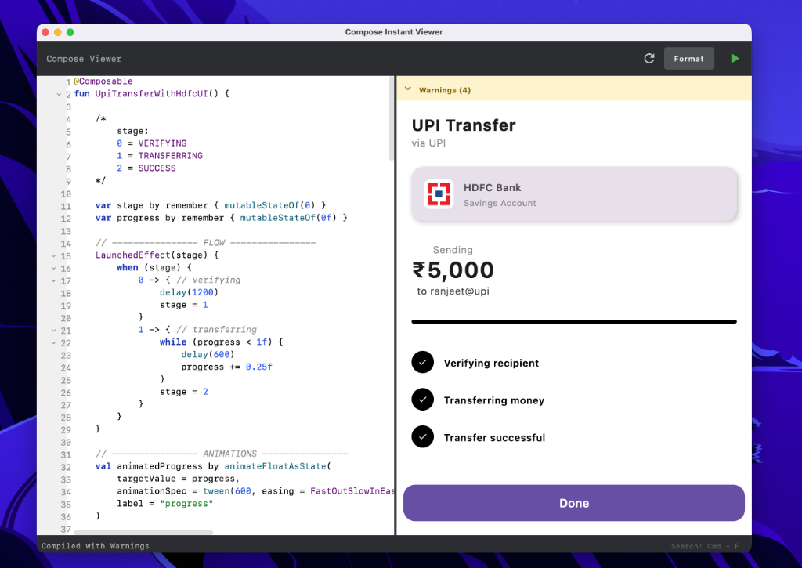

# Compose Viewer v1.0.0

[](https://github.com/ranjeetchouhan/compose-code-viewer/stargazers)
[](https://github.com/ranjeetchouhan/compose-code-viewer/issues)
[](https://opensource.org/licenses/MIT)

**Compose Viewer** is a real-time Jetpack Compose Desktop code editor and previewer. It allows you to write Kotlin Compose UI code and see the results instantly, making it an essential tool for prototyping and learning Compose Multiplatform.



## Features

- **Live Preview**: See your changes instantly as you type or on reload.
- **Syntax Highlighting**: Real-time code coloring for Kotlin/Compose.
- **Smart Editor**:
  - Auto-indentation and bracket matching.
  - Search & Replace (Cmd+F / Ctrl+F).
  - Code folding (Line numbers).
- **Cross-Platform**: Runs natively on macOS, Windows, and Linux.
- **Network Image Support**: Integrated with Coil for loading images from URLs using `AsyncImage`.
- **Helper Utilities**: Built-in support for `maxWidth`, `maxHeight` variables for responsive layout testing.

## Installation

### Prerequisites
- JDK 17 or higher installed.

### Windows
1.  Clone the repository.
2.  Open PowerShell or Command Prompt in the project folder.
3.  Run:
    ```powershell
    gradlew.bat run
    ```

### macOS
1.  Clone the repository.
2.  Open Terminal in the project folder.
3.  Run:
    ```bash
    ./gradlew run
    ```
    *Note: The application name "Compose Viewer" will appear in the Menu Bar.*

## Usage

1.  **Write Code**: Type standard Compose UI code in the left editor pane.
    - The entry point is the `Content` function (implied). Just write your Composable elements (e.g., `Button`, `Text`).
2.  **Run/Reload**:
    - Click the **Green Play Icon** in the top bar to run/compile clearly.
    - Click the **Refresh Icon** to force a preview reload.
3.  **Search**:
    - Press `Cmd+F` (Mac) or `Ctrl+F` (Windows) to open the search bar.
    - Use `Enter` for Next match, `Shift+Enter` for Previous.
4.  **Format**: Click "Format" to auto-format your code.

## Contributing

We welcome contributions! Here's how you can help:

- ⭐ **[Star this repository](https://github.com/ranjeetchouhan/compose-code-viewer)** if you find it useful
- 🐛 **[Report issues](https://github.com/ranjeetchouhan/compose-code-viewer/issues/new)** for bugs or feature requests
- 🔧 Submit pull requests to improve the code
- 📖 Help improve documentation

---

⭐ **[Star this repository](https://github.com/ranjeetchouhan/compose-code-viewer)** if you find it useful!  
🐛 **[Report issues](https://github.com/ranjeetchouhan/compose-code-viewer/issues/new)** for bugs or feature requests

## License

This project is licensed under the MIT License - see the [LICENSE](LICENSE) file for details. You are free to use, modify, and distribute this software.
